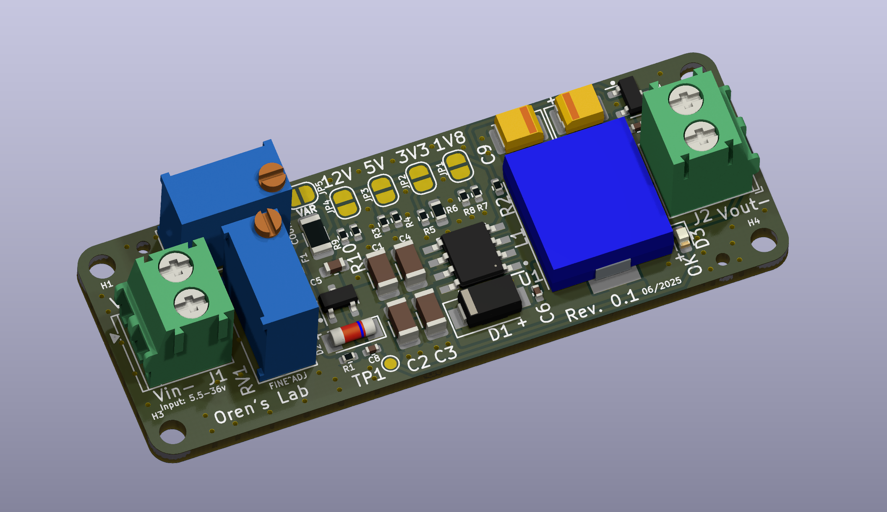
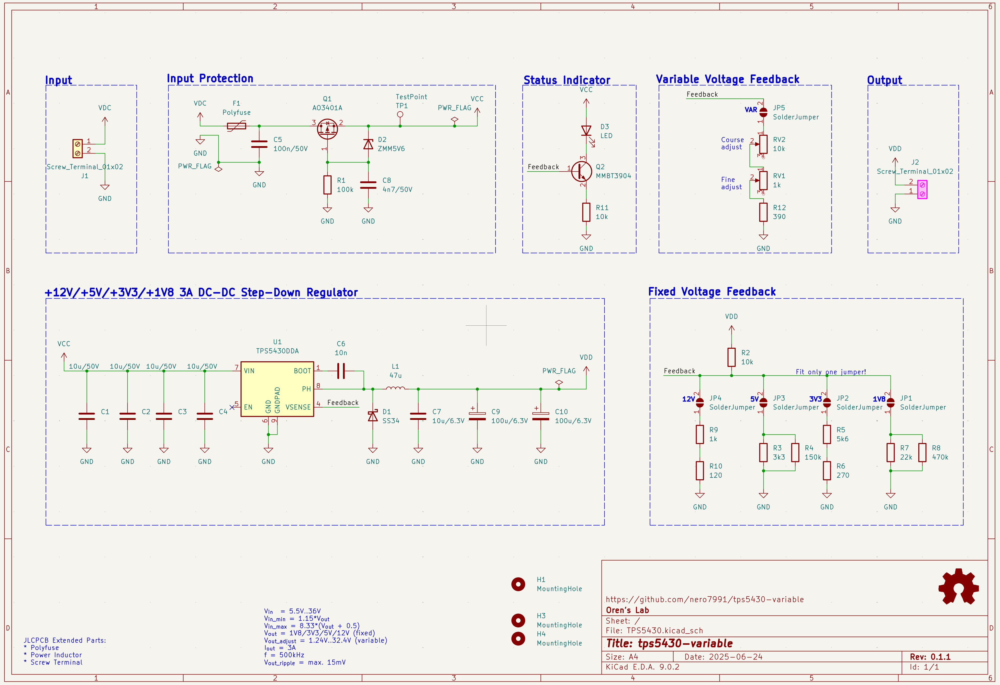

# TPS5430 Variable or VarTPS

This is a DC-DC Buck converter board based on the TPS5430 from TI with both fixed and variable voltage output options, called VarTPS. The board provides four fixed voltage outputs (1.8V, 3.3V, 5V, 12V) selectable via solder jumpers, plus a variable output mode ranging from 1.24V to 32.4V. Variable voltage control is implemented using two 10-turn potentiometers - a 10kΩ potentiometer for coarse adjustment and a 1kΩ potentiometer for fine adjustment, providing approximately 3mV resolution at low voltages. The design includes reverse polarity protection, overcurrent protection via polyfuse, and accepts input and output throught screw terminals.

## Features

* Vin = 5.5V..36V
* Vinmin = 1.15 * Vout (see Datasheet Section 8.2.1.2.8.1)
* Vinmax = 8.33 * (Vout + 0.5) (see Datasheet Section 8.2.1.2.8.1)
* Vout = 1.8V/3.3V/5V/12V (choose via solder bridge)
* Variable voltage out, adjusted using two 10 turn pot with course and fine adjustments. Voutadjust = 1.24V..32.4V (choosen via solder bridge)
* Reverse polarity protection with AO3401A p-MOSFET
* 3A (hold)/6A (trip) polyfuse input protection
* The board can be powered with a 2.1mm/5.5mm "standard" Arduino compatible barrel jack connector.
* Status LED

## Schematic

The design was modified in [KiCAD 9](https://www.kicad.org/) from Max Stabel's [TPS5430 on GitHub](https://github.com/M4a1x/TPS5430) and follows the [TPS5430 datasheet (Section 8.2.1)](https://www.ti.com/lit/ds/symlink/tps5430.pdf) reasonably close in the schmatic as well as the layout (Section 10.2).

Deviations are:

* 2x 100uF tantalum capacitors instead of 1x 220uF, since those are basic parts at JLCPCB
* As suggested a 10uF output bypass capacitor is added
* 4x 10uF input capacitors instead of only 1x
* Multiple output voltage options through increased Inductor (47uH instead of 15uH) and solder jumpers. All outputs should work with the full 3A

## License

Licensed under CERN-OHL-S v2 or any later version. See `LICENSE` for more information.

## Contact

Oren Collaco - [https://orencollaco.com/](https://orencollaco.com) - orencollaco97@gmail.com

Project Link: [https://github.com/Nero7991/tps5430-variable](https://github.com/Nero7991/tps5430-variable)

## Acknowledgements

* [Max Stabel](https://max.stabel.family/), [TPS5430 on GitHub](https://github.com/M4a1x/TPS5430)

* [Philip Salamony](https://philsal.co.uk/) and his [BananaSchplit Project](https://github.com/pms67/BananaSchplit) and [Video](https://www.youtube.com/watch?v=qXWYXxDokv4)
* [ugurozkan52/TPS5430_Power_Module](https://github.com/ugurozkan52/TPS5430_Power_Module) which inspired me to add the output voltage jumpers
